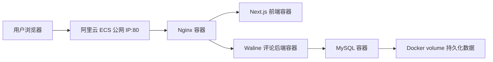

# 云计算大作业报告素材

## 题目

基于 ECS 与 Docker Compose 的个人内容站及登录评论系统部署实践

## 摘要参考

本项目基于阿里云 ECS 部署个人内容站，并使用 Docker Compose 编排 Next.js 前端、Nginx 反向代理、Waline 评论后端和 MySQL 数据库。系统实现了 MDX 博客内容展示、登录后评论、评论数据持久化和公网访问验证。通过该实践，可以理解 IaaS、容器化部署、反向代理、数据库持久化和云端 Web 应用运维等云计算知识。

## 方案设计

系统采用单机多容器架构：

各模块作用：

- ECS：提供云端虚拟机资源，体现 IaaS。
- Docker Compose：统一编排前端、后端、数据库和网关服务。
- Nginx：作为公网统一入口，完成反向代理和服务转发。
- Next.js：提供个人主页、博客列表和 MDX 文章展示。
- Waline：提供登录评论后端能力。
- MySQL：保存评论、用户等动态数据。
- Docker volume：保证数据库容器重启或重建后数据不丢失。

## 云计算知识点对应

| 实践内容 | 对应知识点 | 可写说明 |
|---|---|---|
| 阿里云 ECS | IaaS、虚拟化 | 用户不直接购买物理服务器，而是按需使用云厂商提供的虚拟机资源 |
| 安全组 | 云网络与访问控制 | 只开放 `22` 和 `80`，体现最小权限原则 |
| Docker 容器 | 容器技术、环境一致性 | 前端、后端、数据库运行在独立容器中，减少环境差异 |
| Docker Compose | 编排与自动化部署 | 用一个配置文件描述多服务依赖关系和启动流程 |
| Nginx 反向代理 | Web 架构、网关入口 | 统一接收公网请求，再转发给内部服务 |
| Waline 后端 | 后端服务化 | 评论功能从前端页面中拆出，成为独立服务 |
| MySQL | 数据持久化 | 评论数据不再存储在 MDX 文件中，而是进入数据库 |
| Docker volume | 持久化存储 | 数据库数据与容器生命周期分离，容器重启不丢数据 |

## 实施步骤写法

1. 创建 ECS 实例，配置公网 IP 与安全组。
2. SSH 登录服务器，安装 Docker 和 Docker Compose。
3. 从 GitHub 拉取个人网站项目。
4. 配置 `.env`，填写公网 IP、Waline 站点地址、JWT 密钥和 MySQL 密码。
5. 使用 `docker compose build` 构建前端镜像。
6. 使用 `docker compose up -d` 启动 Nginx、Next.js、Waline 和 MySQL。
7. 访问公网 IP，验证首页、博客页和文章页。
8. 在文章页测试评论区，验证未登录不可评论、登录后可评论。
9. 重启容器，验证 MySQL volume 持久化后评论不丢失。

## 截图清单

- ECS 实例运行中，显示公网 IP。
- 安全组规则，显示 `22/tcp` 和 `80/tcp`。
- SSH 登录成功。
- `docker --version` 和 `docker compose version`。
- GitHub 仓库克隆成功。
- `.env` 配置文件已创建，但截图时遮挡密码。
- `docker compose build` 成功。
- `docker compose ps` 显示四个容器运行。
- 首页公网访问成功。
- `/blog` 或 `/blog/home` 访问成功。
- 文章页评论区出现。
- 未登录时无法评论。
- 登录后评论成功。
- 刷新后评论仍存在。
- `docker volume ls` 显示 MySQL 数据卷。
- `docker compose logs waline` 或 MySQL 日志证明后端和数据库连接正常。

## 问题与解决方案可写点

1. 评论区请求失败  
   原因可能是 Waline 服务地址或 `SECURE_DOMAINS` 配置错误。解决方法是统一设置 `NEXT_PUBLIC_WALINE_SERVER_URL=/waline`，并让 Nginx 将 `/waline/` 反向代理到 Waline 容器。

2. MySQL 数据不能持久保存  
   原因是数据库数据只存在容器内部。解决方法是在 Compose 中配置 `mysql-data` volume，并挂载到 `/var/lib/mysql`。

3. 不直接开放多个端口  
   如果直接开放 `3000`、`8360`、`3306`，会增加公网暴露面。解决方法是只开放 `80`，其他服务只通过 Docker 内部网络访问。

4. 公网 IP 场景下暂不做 OAuth  
   第一版使用公网 IP 和 Waline 账号登录跑通核心流程。后续如果绑定域名和 HTTPS，再扩展 GitHub OAuth 登录。

## 总结参考

本项目从原有静态 MDX 内容站出发，进一步加入登录评论后端和 MySQL 数据持久化，使个人网站从单纯页面展示扩展为包含前端、后端、数据库和网关的完整 Web 应用。通过 Docker Compose，可以把多个服务的部署过程固化为统一配置，降低环境差异带来的问题。通过 Nginx 统一入口和安全组端口控制，系统避免了数据库与内部服务直接暴露到公网。该实践虽然仍是单机部署，但已经覆盖云计算课程中的 IaaS、容器、反向代理、服务拆分和持久化存储等关键知识点，为后续扩展到 HTTPS、多实例负载均衡和自动化运维打下基础。

## 第二阶段：只读运维与数据保护

第二阶段在不修改 Waline 数据库结构、不暴露 Docker Socket 的前提下，增加宿主机
定时采集、只读运维面板和 MySQL 自动备份。宿主机脚本每 5 分钟检查网页与容器状态，
并对最近 24 小时 Nginx 日志进行有界聚合；Next.js 只读取生成后的 JSON，不直接执行
运维命令。该设计体现了权限隔离、可观测性和最小权限原则。

日志分析会统计请求量、404、5xx、热门路径和状态码分布，并以固定规则识别敏感文件
探测、目录穿越、注入关键词、常见 CMS 扫描及短时间请求突发。检测结果只属于启发式
风险提示，不替代 WAF。输出前移除 URL 与 Referer 查询参数，并限制字段和数组长度，
降低 Token 或个人数据进入面板的风险。

数据库每天北京时间 03:30 使用 `mysqldump --single-transaction --quick` 生成压缩备份，
先写临时文件并通过 gzip 校验，再原子改名为正式文件，默认保留最近 7 份。恢复只能
通过 SSH 手工执行，且恢复前自动再创建一份备份。由此可以在报告中补充定时任务、
日志采集、可观测性、启发式安全分析、备份保留策略、恢复点和最小权限等知识点。

新版管理员面板采用专业后台布局，集中展示服务健康、ECS 资源、24 小时请求趋势、
状态码分布、访问来源分类、Top 路径、Top IP、可疑访问事件和备份状态。访问 IP 只
在管理员页面和受保护的 GoAccess 报告中显示，普通用户无法访问这些数据。

外部监控同时配置 UptimeRobot、HetrixTools 和 Better Stack，用于从公网节点探测
首页、博客、Waline 和健康检查接口。它们不能用于本地 `localhost` 测试，因为外部
监控节点无法访问个人电脑内网服务；部署到 ECS 公网 IP 或域名后才能验证。由于部分
境外探测节点访问阿里云可能出现网络超时，报告中可说明采用三套服务交叉观察，并将
阿里云内部监控作为后续付费扩展方向。

建议新增截图：

- 运维面板的服务状态、访问摘要、风险事件和备份状态。
- 管理员面板中的折线图、饼图、Top IP 和外部监控入口。
- `runtime/ops` 中四个 JSON 文件。
- `/etc/cron.d/coordinate-zero-ops` 的两个定时任务。
- `.sql.gz` 备份文件和只读校验成功结果。
- Web 容器仅以只读方式挂载 `runtime/ops`，且未挂载 Docker Socket。
